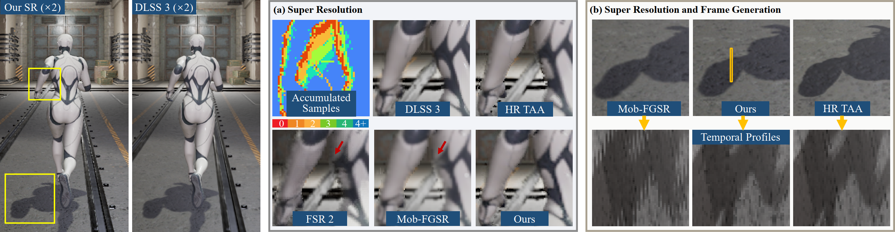

# Lightweight, Edge-Aware, and Temporally Consistent Supersampling for Mobile Real-Time Rendering

This repository contains the official implementation of  
**“Lightweight, Edge-Aware, and Temporally Consistent Supersampling for Mobile Real-Time Rendering.”**  
Our method reconstructs sharp edges, preserves temporal coherence, and achieves real-time performance on mobile GPUs.

---

## 📸 Teaser

Comparison of super resolution (SR) and frame generation (FG) results. The left large images show SR results from our method and DLSS 3 (v3.7.3).  In (a) SR, existing non-neural methods (e.g., FSR 2 and Mob-FGSR) suffer from edge detail loss due to limited sample accumulation, while our method reconstructs smoother edges closer to DLSS 3 and the high-resolution (HR) TAA reference. In (b) FG and SR, our method yields temporally coherent shadow interpolation with smooth temporal profiles, outperforming Mob-FGSR and approaching the visual quality of the HR TAA reference.  Despite the substantial improvement in visual quality, the runtime of our method remains on par with Mob-FGSR, supporting high frame rates on mobile devices.

<p align="center">
  
</p>

---

## 📁 Repository Layout & Environments

```text
0_DATA/                     # Shared data (input/output videos, reference results, etc.)
  └── BK/                     # Test scene
      ├── 540p_color/           # Low-resolution color frames (input)
      ├── 540p_depth/           # Low-resolution depth maps
      ├── 540p_dynamic_mask/    # Dynamic-object masks
      ├── 540p_motion_vector/   # Motion vectors
      ├── 540p_shadow/          # shadow 
      ├── 1080p_color/          # High-resolution ground-truth frames
      ├── 1080p_vsr/            # SR output
      └── 1080p_vsr_itp/        # SR + frame interpolation output
1_LUT_VSR/                 # Lightweight LUT-based SR
2_FG/                      # Frame interpolation module
3_UE/                      # TODO: Unreal Engine plugin integration
README.md
```

---

# 1. Working with `1_LUT_VSR`

This folder contains the core implementation of our lightweight, edge-aware, LUT-based SR method.

---

## 1.1 Create Environment

### 🔧 Environment
No special environment setup is required.  
The LUT-based SR module has been tested under the following configuration:

| Component | Version |
|----------|---------|
| Python   | 3.12    |
| PyTorch  | 2.8.0   |
| CUDA     | 12.8    |

Additional Python dependencies can be installed as needed.

---

## 1.2 Preparing Test Data

Run:

```bash
python 1_LUT_VSR/1img2pth_data.py
```

This converts the input image sequences into a `.pth` file stored at:

```
1_LUT_VSR/temp_pth/BK_VSR_images.pth
```

---

## 1.3 Running the LUT Model and Generating the LUT File

Run:

```bash
python 1_LUT_VSR/3LUT_Infer.py
```

This script produces:

- Super-resolution (SR) output:
  ```
  0_DATA/BK/1080p_vsr/
  ```
- Generated LUT file:
  ```
  1_LUT_VSR/00LUT.pth
  ```

---

## 1.4 (Optional) Training a New LUT File

The default LUT already exhibits strong robustness and does not require retraining.  
If you wish to train new LUT models, run the edge and non-edge training scripts separately:

```bash
python 1_LUT_VSR/2Mob_ISR_0424_training_EdgeOnly.py
python 1_LUT_VSR/2Mob_ISR_0424_training_NonEdge.py
```

Trained checkpoints will be saved at:

```
1_LUT_VSR/checkpoints/E_ckp_4999.pth
1_LUT_VSR/checkpoints/nE_ckp_4999.pth
```

To generate a new LUT file, copy both checkpoints into `1_LUT_VSR/` and rerun **Step 1.3**.

---

# 2. Working with `2_FG`

This folder contains the core implementation of our Temporally Consistent FG method.

---

## 2.1 Create Environment

### 🔧 Environment
This is a native C++20 / DirectX 11 project.  
The FG module has been tested under the following configuration:

| Component           | Tested With          |
|---------------------|------------------------------|
| OS                  | Windows 10 / 11              |
| Compiler            | Visual Studio 2022 (v143)    |
| C++ Standard        | C++20                        |
| DirectX             | DirectX 11  |
| CMake               | 3.21+                        |

Additional dependencies are provided at `source/inc/`.

---


## 2.2 Build FG Code

Run:
```
cd 2_FG
mkdir build
cmake -B build -S .
cmake --build build
```
This will generate the `fg.exe` stored at:
```
build/debug/fg.exe
```

---
## 2.3 Frame Interpolation on Super-Resolution Results
Run:
```
.\build\debug\fg.exe BK <start_frame> <end_frame>
```
Example:
```
.\build\debug\fg.exe BK 6 44
```
This will generate interpolation results:
```
0012.png // input SR result of frame 6
0013.png // interpolation result
0014.png // input SR result of frame 7
...
0088.png // inpur SR result of frame 44
```
The results are stored at:
```
0_DATA/BK/1080p_vsr_itp
```

---
## 2.4 (Optional) Frame Interpolation on Low-Resolution Inputs
You can also run FG module without SR outputs:  

Change the input `color_dir` from `1080p_vsr` to `540p_color`
```
std::string color_dir = std::format("{}/540p_color", resource_dir);
```
Change the output `output_dir` from `1080p_vsr_itp` to `540p_itp`
```
std::string output_dir = std::format("{}/540p_itp", resource_dir);
```
Change the `sr_scale` from `2.0f` to `1.0f`
```
float sr_scale = 1.0f;
```
Rebuild the project:
```
cmake --build build
```
Run:
```
.\build\debug\fg.exe BK <start_frame> <end_frame>
```
The results will be stored at:
```
0_DATA/BK/540p_itp
```
